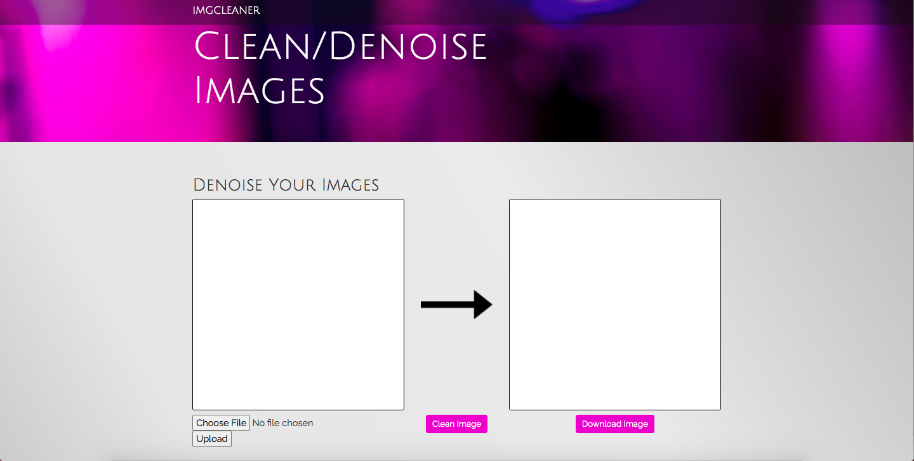
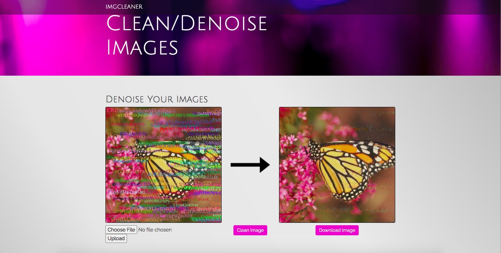
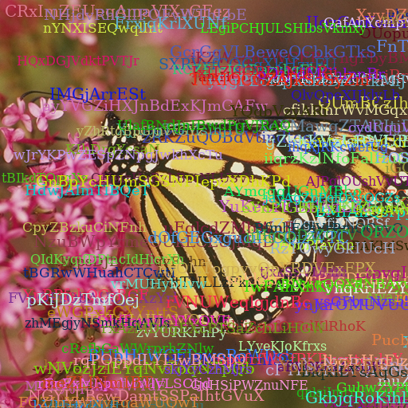
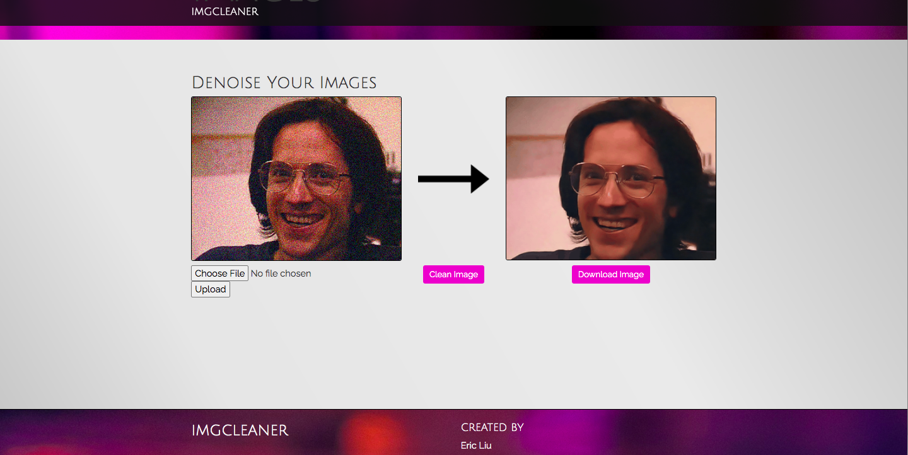

# ImgCleaner

## Regarding the denoise_run.py file

The primary functions are denoise and detext. Denoise are primarily for removing the noise in terms of unclear images; detext is to remove the unnecessary words. 

## Usage

The input should be the path to the images, i.e. "figures/xxx.png", and the output will be a figure itself. E.g. 
`denoise("figures/bignoisy.gif")`
produces the denoised version of the bignoisy image. 

## Start Flask Server

`export FLASK_APP=imgcleaner`
`flask run`